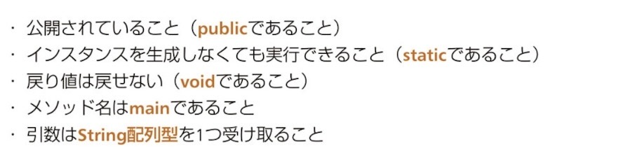
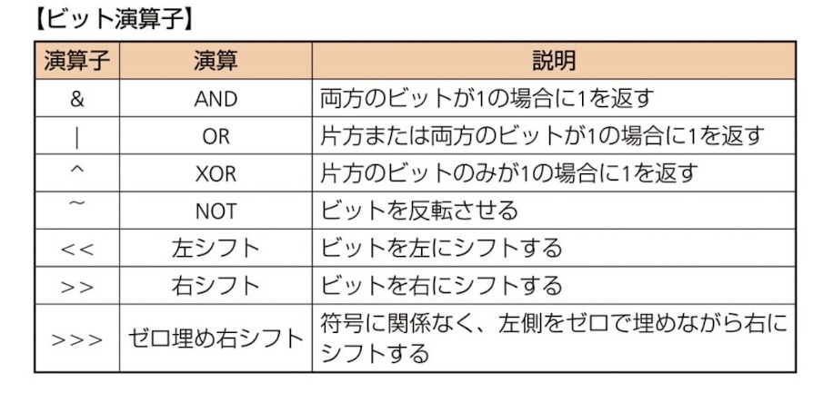
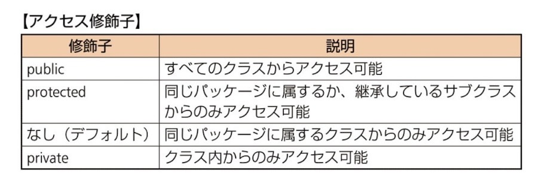

## mainメソッドの5つの鉄則


- public / static / void
- main
- String[] args（1つ）

## javaコマンド

- javac：コンパイル（.java → .class）
  `javac Hello.java`

- java：実行（クラス名）
  `java Hello`

❌ java Hello.class

※ publicクラス名＝ファイル名

## 数値リテラル

- 8進数：0〜7（先頭0）
- 16進数：0x
- _：先頭・末尾・記号の前後❌

## 識別子

- _ $：OK
- 数字始まり：NG
  
## var

右辺によって左辺のデータ型を推論できる場合のみ使用化

⭐️初期化必須！！
- ⭕️ `var a = 10;`
- ⭕️ `var e = new ArrayList<>();` ：ダイヤモンド演算子の型情報がない場合は型推論(`Object`など)
- 型推論：ローカル変数の宣言のみ可(フィールド不可)
- 型推論：コンパイル時に行われる

## String

オブジェクト生成時
- newを使ってインスタンス化
- `""` で文字列リテラルで記述
- immutable(不変)なオフジェクト
- concat：引数として渡された文字列とインスタンスの文字列を連結して戻す

<br>

- String：不変なのでバッファなし
- StringBuilder：16のバッファ(予備)を持っている
  
## mutable(可変) / imutable(不変)

imutable
- String：変更不可（新しいオブジェクトを作る）
- 全てのフィールドを`private`で定義
- クラスをfinalで宣言(override不可)

mutable
- StringBuilder：変更可（元のオブジェクトが変わる）

## 文字列まわり
長さ
- length()：文字数（例："abc".length() → 3）

位置
- charAt(i)：i番目の文字（0開始）
- indexOf("a")：最初に見つかった位置（なければ-1）

切り出し
- substring(a, b)：a以上b未満

メソッドチェイン
- substring(1, 3).replace("b", "c")：bcだけを抽出してその文字列だけを置換

判定
- startsWith("ab")：先頭が一致するか（true/false）
- endsWith：引数の文字で終わっているか

置換
- replace("a", "b")：置き換え（新しい文字列）

反転
- reverse()：abcde->edcba

位置
- indexOf()：開始位置(0から順番)

replace(start, end, str) の数え方
- 「文字そのもの」ではなく「文字の間の仕切り線」を数える
- `start` は含めて、`end` は含めない（endの直前まで）s


## Stringの比較

true = メモリ内にある文字列への参照を戻す
- intern()：newしてもtrue
- String a = "a"：ダブルクォートあり(コンスタントプール)
- .equals()：値比較

false = アドレスが違う
- new：新しい領域

## 値渡し（参照）

- プリミティブ：値がコピーされる
- 参照型：参照（アドレス）がコピーされる

## 配列

- 1番目の要素の要素数は省略できない
  ```
  // ❌コンパイルエラー
  int f[][] = new int [][3;]
- 初期化子があれば[]はブランクとなる
  ```
  ❌int[] array = int[2] {2, 3};

  ⭕️int[] array = int[] {2,3};
  ```

## ArrayList

- スレッドセーフではない(同時にさわれない並列処理はできない)
- add：追加
- set：インデックス指定して置き換え
- remove：インデックス指定して削除

## 繰り返し構文

- 拡張for文：カーソルを戻せないので、削除した次の要素は必ず飛び越し(スルー)される
- for文：`i--` を使うことで、繰り上がってきた要素をもう一度チェックできる

## 演算子





## 比較

equals()

- String(override済み)：**値比較**
- new：**アドレス比較**

    | 比較方法    | Stringの場合   | 自作クラスの場合   |
    | :--------: | :---------: | :-------: |
    | ==    | アドレスを見る（new してれば false）     | アドレスを見る（new してれば false）    |
    | .equals()     | 値を見る（同じなら true）     | アドレスを見る（new してれば false）   |

### 「ぬるぽ」判定ルール

  - ⭐️.equals()：`.`の左側が実行主

    | 比較方法    | a の状態  | b の状態   |結果|
    | :--------: | :---------: | :-------: | :-------: | 
    | a.equals(b)   | new Object() (実体あり) | null|false (安全に比較終了) |
    | b.equals(a)   | null   | new Object()|例外がスロー (ぬるぽ発生)|
    a == b|null|null|true (==ならエラーにならず判定できる)|

<br>

equals()：以下２つがなく、newしていればfalse！！

```
⭐️@Override
⭐️public boolean equals(Object obj) {} //(Object)であること！他は対象外
```
```
// Objectになってるかがポイント

```

⚠️例外：true になるパターン

@Overrideしている場合：同じ「値」ならtrue

- instanceof：型をチェックする（true / false）
    - 親型でもtrue（継承OK）
    - nullはfalse（例外にならない）
    - 無関係な型同士はコンパイルエラー

## 分岐

Swich
- ❌使えないもの
  - long
  - float
  - double
  - boolean
  - ⭐️caseの後ろ(finalならOK)
  - 変数
  - 型が違う(intで定義しているのにStringなど)

- ⭕️使えるもの（⭐️caseの後ろ）
  - リテラル
  - 定数 (finalがついた変数)
  - 定数式 (2*5など)


Swich式
- defaultがないとコンパイルエラー
- `{};`：セミコロンがないとコンパイルエラー

do while
- `{}`なし：doとwhileの間に**1文のみ**しか書けない
- `{}`あり：doとwhileの間に**何文書いてもOK**

## static

- static -> クラスに属する（インスタンス不要）
- ⭐️**staticから非staticは触れない**

■ アクセス
- static → static：⭕️
- 非static(インスタンス) -> static：⭕️
- static -> 非static(インスタンス)：❌ NG（this使えない）

■ ポイント
- static内ではインスタンスメンバに直接アクセス不可
- staticは「クラス名.メンバ」で呼べる

## メンバアクセス

- 参照.メソッド名(引数)：メソッド呼び出し
- 参照.メソッド名：()がないとフィールド参照

（例）
- obj.getName();  // メソッド
- obj.name;       // フィールド

## ラッパー型

- ボクシング：int → Integer（自動）
- アンボクシング：Integer → int（自動）
- nullをintにすると例外（NPE）


## 可変長引数(...)

- 位置のルール： ... は必ず **型のすぐ後ろ** に書く（例：int... values）
- 順番のルール： 他の引数と一緒に使うときは、**一番最後** に書く
- 個数のルール： 1つのメソッドに可変長引数は **1つだけ** しか使えない


## オーバーロード

条件
- 引数の型・数・順番のいずれかが違う
- 戻り値は関係ない（戻り値だけ違いはNG）
- 引数だけで判定（修飾子・戻り値は関係ない）

## アクセス修飾子

- コンストラクタを修飾するアクセス修飾子に制限なし



## コンストラクタ(this)

- this()：同じクラスの別コンストラクタ呼び出し
- - this()：同じクラス
- super()：親クラス
- ⭐️最初の1文のみOK

■ ルール
- 1行目に書く（最重要）
- 2行目以降は❌
- this()：同じクラス
- super()：親クラス

## record

- 不変クラス（immutable）※newが終わったあと、代入後は不変
- フィールドは自動でfinal
- コンストラクタ・getter・equalsなど自動生成
- `toString`, `hashCode`, `equals`メソッドが定義されている
- publicとアクセス修飾子なしのみ🆗
- サブクラスの定義（継承）不可❌
- 引数なしのコンストラクタ生成不可❌
- static以外のインスタンスフィールドは追加不可❌

例：
record Person(String name, int age) {}

コンストラクタ
- 全引数コンストラクタは自動生成される
- 必要なら追加コンストラクタ定義できる
- コンパクトコンストラクタでバリデーション可能(this❌)