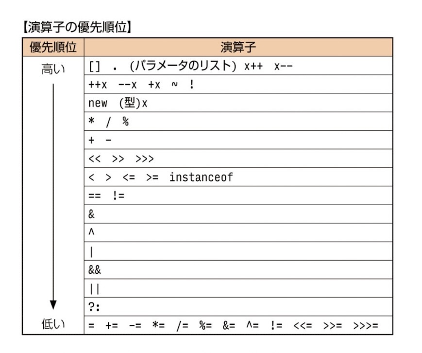

## mainメソッドの5つの鉄則


- **public** であること
- **static** であること（インスタンス化不要！）
- **void** であること（戻り値なし）
- メソッド名は **main** であること
- 引数は **String配列型を1つ** 受け取ること

## javaコマンド
1. javac：コンパイル（.java -> .class生成）
   `javac Hello.java`
2. java：実行（クラス名指定）
   `java Hello`

    【NG】拡張子不要！！
    - ❌ java Hello.class  `javaコマンドにクラスファイル名を渡したらダメ！！`

    ※ publicクラス名＝クラス名.java(ファイル名.java)

    ※ publicなし＝ファイル名じゃなくてOK.java

## 数値リテラル

- **8進数**: 頭に `0` をつける。**0〜7** のみ
    - `int b = 0413;` ⭕️（0〜7のみ）
    - `int e = 0827;` ❌（8は使えないのでコンパイルエラー）
- **16進数**: 頭に `0x` をつける。
  
- `_`：❌リテラルの先頭＆末尾 / 記号の前後も❌

## 識別子

 - `_` `$`：OK
 - 数字はじまり：NG
  
## var

右辺によって左辺のデータ型を推論できる場合のみ使用化
- ⭕️ `var a = 10;`
- ⭕️ `var e = new ArrayList<>();` ：ダイヤモンド演算子の型情報がない場合は型推論(`Object`)
- 型推論：ローカル変数の宣言のみ可(フィールド不可)
- 型推論：コンパイル時に行われる

## String

オブジェクト生成時
- newを使ってインスタンス化
- `""` で文字列リテラルで記述
- immutable(不変)なオフジェクト
- concat：引数として渡された文字列とインスタンスの文字列を連結して戻す

<br>

- String：不変なのでバッファなし
- StringBuilder：16のバッファ(予備)を持っている
  
## mutable(可変) / imutable(不変)

imutable
- String
- 全てのフィールドを`private`で定義
- クラスをfinalで宣言(override不可)

mutable
- Stringbuilder

## 文字列まわり
長さ
- length()：文字数（例："abc".length() → 3）

位置
- charAt(i)：i番目の文字（0開始）
- indexOf("a")：最初に見つかった位置（なければ-1）

切り出し
- substring(a, b)：a以上b未満

メソッドチェイン
- substring(1, 3).replace("b", "c")：bcだけを抽出してその文字列だけを置換

判定
- startsWith("ab")：先頭が一致するか（true/false）
- endWish：引数の文字で終わっているか

置換
- replace("a", "b")：置き換え（新しい文字列）

反転
- reverse()：abcde->edcba

位置
- indexOf()：開始位置(0から順番)

replace(start, end, str) の数え方
- 「文字そのもの」ではなく「文字の間の仕切り線」を数える
- `start` は含めて、`end` は含めない（endの直前まで）s


## 参照
true = メモリ内にある文字列への参照を戻す
- intern()：newしてもtrue
- String a = "a"：ダブルクォートあり(コンスタントプール)
- .equals()：値比較

false = アドレスが違う
- new：新しい領域

## 配列

- 1番目の要素の要素数は省略できない
  ```
  // ❌コンパイルエラー
  int f[][] = new int [][3;]
- 初期化子があれば[]はブランクとなる
  ```
  ❌int[] array = int[2] {2, 3};

  ⭕️int[] array = int[] {2,3};
  ```

## ArrayList

- スレッドセーフではない(同時にさわれない並列処理はできない)
- add：追加
- set：インデックス指定して置き換え
- remove：インデックス指定して削除

## 繰り返し構文

- 拡張for文：カーソルを戻せないので、削除した次の要素は必ず飛び越し(スルー)される
- for文：`i--` を使うことで、繰り上がってきた要素をもう一度チェックできる

## 演算子




## 比較

equals()

- String：**値比較**
- new：**アドレス比較**

| 比較方法    | Stringの場合   | 自作クラスの場合   |
| :--------: | :---------: | :-------: |
| ==    | アドレスを見る（new してれば false）     | アドレスを見る（new してれば false）    |
| .equals()     | 値を見る（同じなら true）     | アドレスを見る（new してれば false）   |

### 「ぬるぽ」判定ルール
⭐️.equals()：`.`の左側が実行主

| 比較方法    | a の状態  | b の状態   |結果|
| :--------: | :---------: | :-------: | :-------: | 
| a.equals(b)   | new Object() (実体あり) | null|false (安全に比較終了) |
| b.equals(a)   | null   | new Object()|例外がスロー (ぬるぽ発生)|
|a == b|null|null|true (==ならエラーにならず判定できる)|

<br>

equals()：以下２つがなく、newしていればfalse！！

```
⭐️@Override
⭐️public boolean equals(Object obj) {} //(Object)であること！他は対象外
```
```
// Objectになってるかがポイント

```

⚠️例外：true になるパターン

@Overrideしている場合：同じ「値」ならtrue

## 分岐

Swich
- ❌使えないもの
  - long
  - float
  - double
  - boolean
  - ⭐️caseの後ろ
  - 変数
  - 型が違う(intで定義しているのにStringなど)

- ⭕️使えるもの（⭐️caseの後ろ）
  - リテラル
  - 定数 (finalがついた変数)
  - 定数式 (2*5など)


Swich式
- defaultがないとコンパイルエラー
- `{};`：セミコロンがないとコンパイルエラー

do while
- `{}`なし：doとwhileの間に**1文のみ**しか書けない
- `{}`あり：doとwhileの間に**何文書いてもOK**