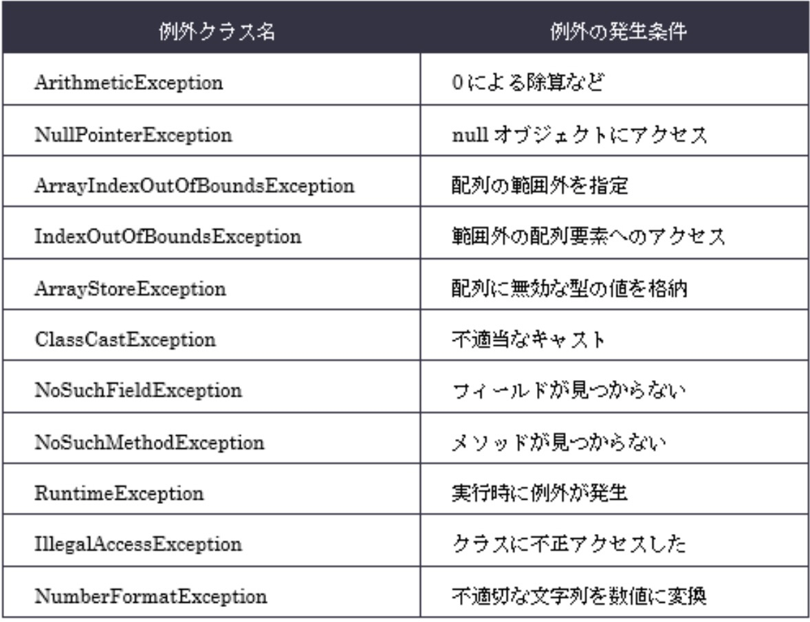

## mainメソッドの5つの鉄則


## java / javac コマンド

- javac：コンパイル（.java → .class）

  `javac Hello.java`
- javacで指定できるのはpublicなクラスのみ（同じクラス名であること）
- 1つのソースファイルに**publicは1つ**のみ、それ以外の複数クラスの記述可

- java：実行（クラス名）
  java Hello

❌ java Hello.class

- ⭐依存関係があれば依存元のみ指定すればOK
- -d：classファイルの出力先
- -cp：classファイルを探す場所(classpath)

package付きクラスの実行
- java パッケージ名.クラス名

  ```
  例

  package ex15;

  javac -d build ex15/Sample.java ex15/Main.java
  → build/ex15/Main.class ができる

  java -cp build ex15.Main
  → build を基準に ex15/Main.class を探して実行
  ```

順番

① javac（コンパイル）
→ ファイルパス指定

- スラッシュ（/）必要
- .java 必要

例
javac ex15/Main.java

② java（実行）
→ 完全修飾クラス名指定

- package名.クラス名
- スラッシュ不要
- .class不要

例
java ex15.Main

## 数値リテラル
⭐整数してらるは全てInteger型（Lを付けた場合のみlong）
- 2進数：Ob...
- 8進数：0〜7（先頭0）
- 16進数：0x
- _：先頭・末尾・記号の前後❌

## 識別子
- _ $：OK
- 数字始まり：NG
  
## var
- 右辺によって左辺のデータ型を推論できる場合のみ使用可
- ローカル変数のみOK（フィールド不可）
- 初期化必須（右辺から型推論）
- 型推論はコンパイル時に行われる

⭐️初期化必須！！
- ⭕️ `var a = 10;`
- ⭕️ `var e = new ArrayList<>();` ：ダイヤモンド演算子の型情報がない場合は型推論(`Object`など)

## String
オブジェクト生成時
- newを使ってインスタンス化
- `""` で文字列リテラルで記述
- immutable(不変)なオフジェクト
- concat：引数として渡された文字列とインスタンスの文字列を連結して戻す

<br>

- String：不変なのでバッファ(予備)なし
- StringBuilder：16のバッファ(予備)を持っている

## StringBuilder
- append("a")：後ろに追加
- toString()：Stringに変換
- reverse()：反転
  
## mutable(可変) / imutable(不変)
imutable
- String：変更不可、変更系メソッドも❌
- 全てのフィールドを`private`で定義
- クラスをfinalで宣言(override不可)

mutable
- StringBuilder：変更可（元のオブジェクトが変わる）

## 文字列まわり
長さ
- length()：文字数（例："abc".length() → 3）

位置
- charAt(i)：i番目の文字（0開始）
- indexOf("a")：最初に見つかった位置（なければ-1）
- indexOf()：開始位置(0から順番)

切り出し
- substring(a, b)：a以上b未満
- substring(a)：aから後ろを切り出し

メソッドチェイン
- substring(1, 3).replace("b", "c")：bcだけを抽出してその文字列だけを置換

判定
- startsWith("ab")：先頭が一致するか（true/false）
- endsWith：引数の文字で終わっているか

置換
- replace("a", "b")：置き換え（新しい文字列）

反転
- reverse()：abcde->edcba

連結
- concat("x")：文字列を後ろに連結
  "ab".concat("c") → "abc"

  [注意]
- null.concat(...) → NullPointerException

replace(start, end, str) の数え方
- 「文字そのもの」ではなく「文字の間の仕切り線」を数える
- `start` は含めて、`end` は含めない（endの直前まで）

  
  
  [注意]
- `concat`や`replace`してもStringの元は変わらない

## Stringの比較

### **`==`：同じアドレスを見る**：メモリ内にある文字列への参照を戻す

⭕️ true
- リテラル同志
- コンスタントプール（`""`のこと）共有
  ```
  "a" == "a"
  ```
  ```
  // a == b⭕️
  String a = "a";
  String b = "a";
  ```
❌ false
- newすると別オブジェクト

### **`equals()`： 中身（値）を見る**
⭕️ true
- 一方でもnewしててもtrue
- StringはequalsをOverride済み
  ```
  "a".equals(new String("a"))
  ```

❌ false
- new：新しい領域（どちらかがnewしていれば❌）
    ```
    new String("a") == "a"
    ```
- 自作クラス
- equals未Override
  ```
  @Override
  public boolean equals(Object obj)

  // 上の2行がないとfalse
  new Dog("P").equals(new Dog("P"))
  ```
### `intern()`
⭕ true
- intern()でコンスタントプール使用

  ⭐intern()：newしてもダブルクォートありのリテラルと比較ならtrue⭕️
  ```
  new String("a").intern() == "a"
  ```

## StirngBuilder
- .equals()：false❌（toStringを使うとtrue⭕️）
- toString().equals()：文字列比較できる⭕️

## 値渡し（参照）
- プリミティブ：値がコピーされる
- 参照型：参照（アドレス）がコピーされる

## 配列
- 1番目の要素の要素数は省略できない
  ```
  // ❌コンパイルエラー
  int f[][] = new int [][3;]
- 初期化子があれば[]はブランクとなる
  ```
  ❌int[] array = int[2] {2, 3};

  ⭕️int[] array = int[] {2,3};
  ```

## ArrayList
- スレッドセーフではない(同時にさわれない並列処理はできない)
- add：追加
- set：インデックス指定して置き換え
- remove：インデックス指定して削除

## 繰り返し構文
- 拡張for文：カーソルを戻せないので、削除した次の要素は必ず飛び越し(スルー)される
- for文：`i--` を使うことで、繰り上がってきた要素をもう一度チェックできる

## 演算子


## 比較
equals()

- String(override済み)：**値比較**
- new：**アドレス比較**

    | 比較方法    | Stringの場合   | 自作クラスの場合   |
    | :--------: | :---------: | :-------: |
    | ==    | アドレスを見る（new してれば false）     | アドレスを見る（new してれば false）    |
    | .equals()     | 値を見る（同じなら true）     | アドレスを見る（new してれば false）   |

## 「ぬるぽ」判定ルール
  - ⭐️.equals()：`.`の左側が実行主

    | 比較方法    | a の状態  | b の状態   |結果|
    | :--------: | :---------: | :-------: | :-------: | 
    | a.equals(b)   | new Object() (実体あり) | null|false (安全に比較終了) |
    | b.equals(a)   | null   | new Object()|例外がスロー (ぬるぽ発生)|
    a == b|null|null|true (==ならエラーにならず判定できる)|

<br>

equals()：以下２つがなく、newしていればfalse！！

```
⭐️@Override
⭐️public boolean equals(Object obj) {} //(Object)であること！他は対象外
```
```
// Objectになってるかがポイント

```

⚠️例外：true になるパターン

@Overrideしている場合：同じ「値」ならtrue
⭐Stirngは@Overrideしている

- instanceof：型をチェックする（true / false）
    - 親型でもtrue（継承OK）
    - nullはfalse（例外にならない）
    - 無関係な型同士はコンパイルエラー

## instanceof
### 型チェック
- `obj instanceof A` ：obj が A or 子ならtrue（型チェック）
- `obj instanceof A b`：trueのときだけ b として使える（パターンマッチ）
- 親型でもOK
- 無関係な型：コンパイルエラー
- null：false（例外にならない）
  ```
  null instanceof String → false
  ```

## 分岐
Switch
- ❌使えないもの
  - long
  - float
  - double
  - boolean

caseの後ろ
- ⭕️使えるもの
  - リテラル
  - final（定数）
  - 定数式 (2*5など)
- ❌使えないもの
  - 普通の変数

  ```
  ⭕️OK
  final int a = 10;
  case a:
  ```

  ```
  ❌コンパイルエラー
  int a = 10;
  case a:
  ```
Switch式
- defaultがないとコンパイルエラー
- `{};`：セミコロンがないとコンパイルエラー

do while
- `{}`なし：doとwhileの間に**1文のみ**しか書けない
- `{}`あり：doとwhileの間に**何文書いてもOK**

## static
アクセス
- static → クラスに属する（共有・インスタンス不要）
- staticは「クラス名.メンバ」で呼べる
- static内ではインスタンスメンバに直接アクセス不可❌
- static → static：⭕️
- 非static(インスタンス) -> static：⭕️
- static → 非static(インスタンス)：❌（this使えない）→newすればOK

ポイント
- static変数は全インスタンスで共有
　- static：公園の時計（腕時計にはアクセス不可）
  - 非static：腕時計（公園の時計に合わせる）
- staticは「クラス名.メンバ」で呼べる
- static ≠ 変更不可
- 変更不可にしたい場合は final を使う

  | 比較方法    | メモリの場所  | 場所イメージ| 書き換えたら |
  | :--------: | :---------: | :-------: | :-------: |
  | 普通の変数  | ヒープ（個別の住所） | 自分専用のノート| 自分だけ変わる |
  | static変数  | メソッドエリア（共通の住所）   | 教室の黒板| 全員分が同時に変わる |

## メンバアクセス
- 参照.メソッド名(引数)：メソッド呼び出し
- 参照.メソッド名：()がないとフィールド参照

（例）
- obj.getName();  // メソッド
- obj.name;       // フィールド

## ラッパー型
- オートボクシング：箱詰め
  - 裸の数字 → 箱入りの数字
  - int → Integer（自動） 
  - double → Double
  - char →- Character
  - boolean → Boolean

- アンボクシング：箱出し
  - 箱入り → 裸の数字を取り出す
  - Integer → int（自動）
  - nullをintにすると例外（NPE）
  ```
  Integer n = null; // 箱の中身が空っぽ（null）
  int x = n;        // 箱から出そうとしたら…中身がない！ ➡️ NullPointerException（ぬるぽ）
  ```

## 可変長引数(...)
- 位置のルール： ... は必ず **型のすぐ後ろ** に書く（例：int... values）
- 順番のルール： 他の引数と一緒に使うときは、**一番最後** に書く
- 個数のルール： 1つのメソッドに可変長引数は **1つだけ** しか使えない

## アクセス修飾子
- public > protected > なし > private

  | 修飾子       | 見える範囲              |
  |:---------:|:------------------:|
  | public    | 全部                 |
  | protected | package + subclass |
  | なし        | packageのみ          |
  | private   | 自分だけ               |

  ```
  public
  → どこからでもOK

  protected
  → 同じpackageならOK
  → 違うpackageは「継承」が必要

  なし（default/package private）
  → 同じpackageだけOK

  private
  → 同じクラスだけOK
  ```

- トップレベルクラス（外側のクラス）で使える修飾子
→ public または なし(default) のみ
※ protected / private / static は不可（インナークラスでは使用可）

- protected/private/static
→ トップレベルクラスでは不可

- コンストラクタを修飾するアクセス修飾子に制限なし


- サブクラス宣言
  - static：インナークラスのみ使用可
  - private：インナークラスのみ使用可
  - non-sealed：シールクラスのサブクラスのみ使用可
  - protected：トップクラス宣言で使用不可❌（インナークラスでは使用可能）※違うpackageでは「継承 + 子クラス経由」が必要

## コンストラクタ(this)
- `public class クラス名()`：クラス名ならコンストラクタ
- new子() → 親 → 子 の順：new したら「親（super）」から順に生まれる
- super()：親コンストラクタ
- this()：同じクラスの別コンストラクタ
- this() / super() ：1行目のみ & どちらか1つだけ記述できる

ルール
- 1行目に書く（最重要）2行目以降は❌
- this() / super()：一番最初に実行される
- this()：同じクラス
- super()：親クラス

## record
### データを保持するためだけのクラスを1行で、超シンプルに書くための仕組み
- 不変クラス（immutable）※newが終わったあと、代入後は不変
- フィールドは自動でfinal
- コンストラクタ・getter・equalsなど自動生成
- `toString`, `hashCode`, `equals`メソッドが定義されている
- publicとアクセス修飾子なしのみ🆗
- サブクラスの定義（継承）不可❌
- 引数なしのコンストラクタ（デフォルトコンストラクタ）生成不可❌`list.add(new Item());`
- static以外のインスタンスフィールドは追加不可❌

  ```
  ⭕️
  record Person(String name, int age) {}
  ```
  ```
  ⭕️
  record Person(String name, int age) {
      static String planet = "Earth"; // ⭕️static（みんなの共通ルール）ならOK！
  }
  ```

  ```
  record Person(String name, int age) {
    int height; // ❌「static以外のインスタンスフィールド」はNG！
  }
  ```


コンストラクタ
- 全引数コンストラクタは自動生成される
- 必要なら追加コンストラクタ定義できる
- コンパクトコンストラクタでバリデーション可能(this❌)

## 継承
引き継ぎNG❌
- コンストラクタ
- privateなフィールド、メソッド
- 多重継承

- フィールド：左辺の見た目で決まる（コンパイル時）
- メソッド：右辺の実際の中身で決まる（実行時）
- （`Parent p = new Child();` のとき）

オーバーライド不可❌
- private
- static
- final

## インターフェース
- 実体化（インスタンス化）不可 ❌
- final不可 ❌
- 多重実装OK ⭕️
- メソッドは基本 public abstract（自動）
- 「できること」（型）を定義するもの
- privateの場合：中身のソースがないと❌

defaultメソッド
- 実装クラスで必須ではない
- そのまま使える
- 必要ならオーバーライド可能
- Objectクラスのメソッド(`toString()` / `equals()` / `hashCode()`)の定義不可❌

abstract class
- final不可 ❌
- abstractメソッド（中身なし）を持てる
- 具象メソッド（中身あり）も持てる
- abstract class自身もインスタンス化不可❌

普通クラス（abstractなし）
- abstractメソッドを残せない
- 未実装メソッドは全部実装必要

## クラスの種類
抽象クラス（abstract class）
- インターフェースの共通部分を定義する（インターフェースを実装するクラスが楽できる）
- インスタンス化できない→サブクラスが必要
- 抽象メソッド（中身なしの未完成メソッド）を持てる `;`中身がないので`{}`はない
- 具象ソッド（中身あり）も持てる `{}`あり
- フィールドも持てる
- コンストラクタも持てる

抽象メソッド
- 中身がないメソッド（処理が書いてない）

具象クラス
- 普通のクラス（インスタンス化できる）
- 抽象メソッドをすべて実装する必要がある

## シグニチャ（signature）
- メソッド名 + 引数リスト（型・数・順番）のこと

  ※戻り値は含まない❌

例
void test(int a)

メソッド名：test
引数：int

→ シグニチャ = test(int)
  
##  オーバーライド（override）
- シグニチャ：同じ
- 実行されるメソッド：new側（実体）で決まる

  ```
  例
  A a = new B();
  → Bのoverrideメソッドが動く
  ```

- throws句：親より広げられない
- 親クラスのメソッドを上書き
- メソッド名：同じ
- 引数：型・数・順番がすべて同じ
- 戻り値：同じ or サブクラス型（子クラスの型）
- アクセス修飾子：子クラス ≥ 親クラス（子は親より強い）

##  オーバーロード（overload）
- シグニチャ：違う
- 引数違い：左側の型で判定
- 引数の型・数・順番のいずれかが違う
- 戻り値は関係ない（修飾子・戻り値だけ違いは関係ない）

## 優先順位
変数
1. ローカル変数（スコープ内）
2. フィールド変数

## sealedクラス（シールクラス）
### 継承できるクラスをあらかじめ指名しておく仕組み
- sealed：継承クラス制限（継承できるクラスを限定）
- permits：継継承許可クラス指定

子クラス
- final / sealed / non-sealed のいずれか必須
- 子がsealedの場合：子にモpermits 必須

  ```
  sealed class A permits B
  ```

## 例外処理
- throw：エラー発生（即停止）
- throws：エラー出すかも宣言

流れ
メソッド呼ぶ → throw → catchに飛ぶ

- throwされたら下の処理は実行されない
- catch：上から順にチェック
- finally：
  - 必ず実行される（※強制終了除く）
  - finallyに**return**があると割り込みする(catchのreturnより先に出力)
- returnがなければ通常通り上から（割り込みなし）
- try / finallyブロック：１つのみ記述可
- catchブロック：複数記述可

- エラー：`throw句`に宣言する必要なし

- ネスト：内側から処理開始
- 自作例外のサブクラス： 
  - `java.lang.Exception` ：例外（チェック例外）必要条件
  - `java.lang.RuntimeException`：実行時例外（非チェック例外）必須ではない

## 例外の種類
チェック例外（コンパイル時にチェック）
- Exception：例外クラスの親
- IOException：外部入出力（ファイル・通信）
- SQLException：データベース関連

非チェック例外（実行しないとわからない）
- IndexOutOfBoundsException：スーパークラス（配列、文字列、コレクション）
- ArrayIndexOutOfBoundsException：配列（要素外アクセス）
- StringIndexOutOfBoundsException：文字列（範囲外）
- IllegalStateException：状態がおかしい

Error
- StackOverflowError：無限再帰
- ExceptionInInitializerError：static初期化失敗

 ```
 Index系 → 範囲外
 StackOverflow → 無限ループ（再帰）
 IllegalState → 状態ミス
 InitializerError → static初期化ミス
 ```
  

## マルチキャッチ
### 1つの catch ブロックで複数の異なる例外をまとめて捕まえるための仕組み
- `|`で区切る
- 継承関係にある例外は同時に指定できない(例：Exception | RintimeException❌)
- 変数は暗黙的にfinal（再代入不可）

## try-with-resources
### ファイルやデータベースなど「使い終わったら必ず閉じなければいけないもの（リソース）」を自動でお片付け（close）してくれる超便利な仕組み
- try() にリソースを書く←この形が目印👀
- 自動でcloseされる（finallyいらない）
- AutoCloseableを実装している必要あり
- → リソース自動クローズが目的（例外処理ではない）
- `java.io.Closeable`インターフェース / `java.lang.AutoCloseable`インターフェースのいずれかを実装したクラス
- try()の中
→ `AutoCloseable` / `Closeable` のクラスだけOK

実行順
1. try中で例外
   
   ⬇️
2. close()
      
   ⬇️
3. catch
    
   ⬇️
4. finally

書き方
- カッコの中で「宣言」と「作成」をセットで記述する
```
try( ){ // tryの後ろにカッコがあれば「try-with-resources」
    処理
}
```

```
try (Scanner sc = new Scanner(System.in)) {
    System.out.println(sc.nextLine());
}
```
<br>

- 外で先に作っておいた「変数」を、あとからカッコに入れる
```
クラス 変数 = new クラス();
    try (変数) {
        処理
    }
```

```
Scanner sc = new Scanner(System.in);

try (sc) {  // ⭕ Java9以降
}
```

※初期化必須

※AutoCloseable系のみOK

## 順番
try-with-resources
- 複数のリソース(a,b,c)を扱う場合：
  - open：a→b→c
  - close：c→b→a
- 例外発生時
  - close→catch→fainally(finallyが最後)

## import文
- ワイルドカード(`*`)：クラス名のみ使用可⭕️ / パッケージの途中は使用不可❌

  パッケージ宣言の最下層（class）のみ指定可⭕️

## コマンドライン引数
- `""`は文字の区切り

  ```
  // java クラス名(Aクラスを動かせ)
  java A "A B" A B

  // 結果
  // A BAB
  ```